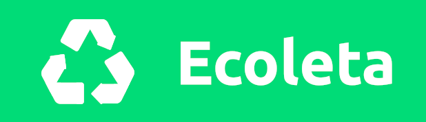
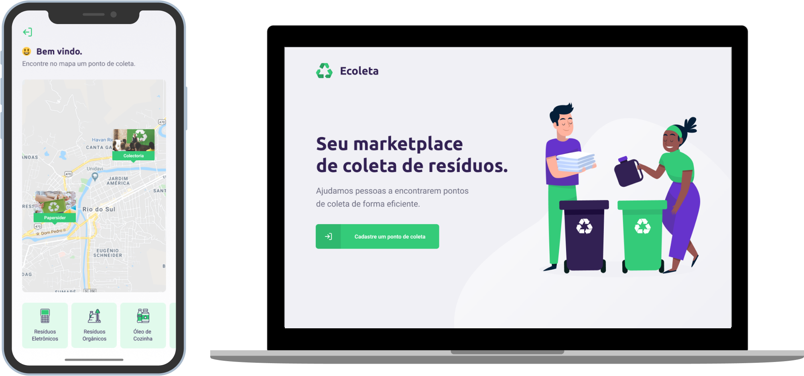

<h1 align="center">
    
</h1>

<p align="center">
  <a href="#-Sobre">Sobre</a>&nbsp;&nbsp;&nbsp;|&nbsp;&nbsp;&nbsp;
  <a href="#-projeto">Projeto</a>&nbsp;&nbsp;&nbsp;|&nbsp;&nbsp;&nbsp;
  <a href="#-tecnologias">Tecnologias</a>&nbsp;&nbsp;&nbsp;|&nbsp;&nbsp;&nbsp;
  <a href="#-como-clonar-e-executar-o-projeto">Como clonar e executar o projeto</a>
</p>

<br />

<h1 align="center">
    
</h1>

<br />

## 📑 Sobre

O **Ecoleta** é um marketplace que ajuda pessoas a encontrarem pontos de coleta de resíduos de forma eficiente.

---

## 💻 Projeto

O **Ecoleta** é um projeto back-end, web e mobile construído durante a **Next Level Week #1 Booster** da **Rocketseate**.

**Novas features serão incluídas...**

---

## 🚀 Tecnologias
Esse projeto foi desenvolvido com as seguintes tecnologias:

### Back-end
- [NodeJS](https://nodejs.org/)
- [TypeScript](https://www.typescriptlang.org/)
- [Express](https://expressjs.com/)
- [Knex.JS](http://knexjs.org/)
- [Celebrate](https://github.com/arb/celebrate)

### Web
- [ReactJS](https://reactjs.org/)
- [TypeScript](https://www.typescriptlang.org/)
- [Axios](https://github.com/axios/axios)
- [Leaflet](https://leafletjs.com/)

### Mobile
- [React Native](https://reactnative.dev/)
- [TypeScript](https://www.typescriptlang.org/)
- [Axios](https://github.com/axios/axios)
- [Expo](https://expo.io/)

---

## 💾 Como clonar e executar o projeto

### Realizar o clone do projeto:
```bash
git clone https://github.com/aigorfreitas/nlw1-booster-ecoleta.git
```

### Executar server Back-end:
```bash
# Abra a pasta /server e realize a instalação das dependências:
npm install

# Para iniciar o servidor back-end, crie um aquivo .env na raiz do projeto 
# com as variáveis de ambiente correspondentes ao seu banco de dados para 
# configuração da conexão no arquivo /src/database/connection.ts.

# Esse projeto foi configurado para usar o Mysql como BD.

# Cria as tabelas no BD:
npm run knex:migrate

# Cria no BD os registros iniciais necessários para iniciar a aplicação:
npm run knex:seed

# Iniciar o server:
npm run dev
```

### Executar app Web:
```bash
# Abra a pasta /web e realize a instalação das dependências:
npm install

# Iniciar o projeto web:
npm start
```

### Executar app Mobile:
```bash
# Abra a pasta /mobile e realize a instalação das dependências:
npm install

# Iniciar o app mobile:
npm start

# Será aberta uma aba no seu nevegador com um QRCODE, que poder ser lido
# pelo app Expo, que deverá estar instalado no seu celular para executar
# o app Ecoleta (mais informações no site https://expo.io/).
```

---
Desenvolvido por 💜 **Alisson Igor Freitas de Oliveira**.